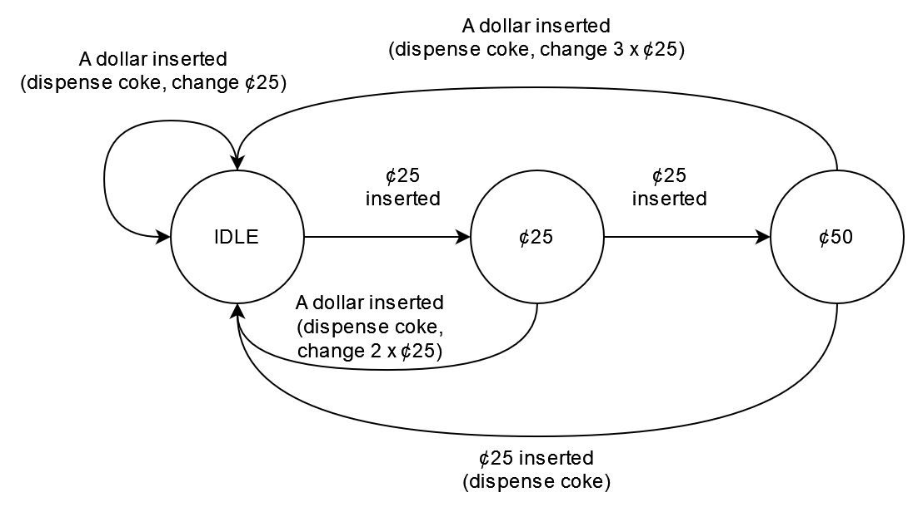
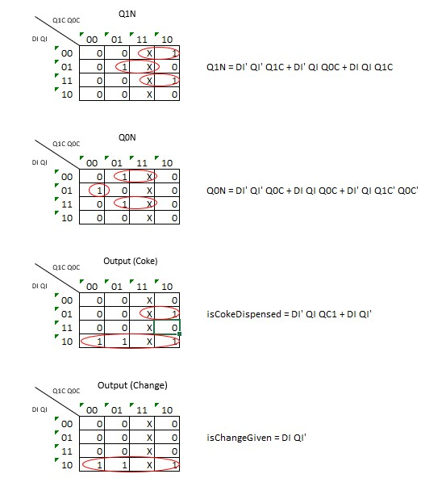

# Coke Vending Machine

## Preface

For the project, I create a finite state machine for a coke vending machine. Each coke cost 75 cent. The nominal of the money that we can insert is a dollar and quater cent (25 cent). Here is the details of the vending machine:

State:

- Idle (I): The vending machine is idle and waiting the customer to insert money to buy coke.
- 25 cent (25c): The vending machine currently store 25 cent that has been inserted into the machine.
- 50 cent (50c): The vending machine currently store 50 cent that has been inserted into the machine.

Input:

- A dollar ($1): Money with 1 dollar nominal.
- A quater (25c): Money with 25 cent nominal.

Output:

- Coke (Co): The item that will be dispense by the machine.
- Change (Ch): The vending machine dispenses change, if necessary.

## Finite State Machine (FSM) Diagram

## State Transition Table

### Normal Representation

| Current State | Input | Next State | Output       |
| ------------- | ----- | ---------- | ------------ |
| Idle          | none  | Idle       | none         |
| Idle          | $1    | Idle       | Coke, Change |
| Idle          | 25c   | 25c        | none         |
| 25c           | none  | 25c        | none         |
| 25c           | 25c   | 50c        | none         |
| 25c           | $1    | Idle       | Coke, Change |
| 50c           | none  | 50c        | none         |
| 50c           | 25c   | Idle       | Coke         |
| 50c           | $1    | Idle       | Coke, Change |

### Boolean Representation

| Current State | Input (Dollar) | Input (Quater) | Next State | Output (Coke) | Output (Change) |
| ------------- | -------------- | -------------- | ---------- | ------------- | --------------- |
| Idle          | 0              | 0              | Idle       | 0             | 0               |
| Idle          | 1              | 0              | Idle       | 1             | 1               |
| Idle          | 0              | 1              | 25c        | 0             | 0               |
| 25c           | 0              | 0              | 25c        | 0             | 0               |
| 25c           | 0              | 1              | 50c        | 0             | 0               |
| 25c           | 1              | 0              | Idle       | 1             | 1               |
| 50c           | 0              | 0              | 50c        | 0             | 0               |
| 50c           | 0              | 1              | Idle       | 1             | 0               |
| 50c           | 1              | 0              | Idle       | 1             | 1               |

### State Encoded Representation

To create a state encoded representations of the state transition table, we need to encode the state to a specific binary code combination.
The code of each state:

| State | Code |
| ----- | ---- |
| Idle  | 00   |
| 25c   | 01   |
| 50c   | 10   |

We then create and alias to represent the code of the state, Q1 and Q0. Q1 is for the most left, and Q0 is for the most right. Here is the state encoded table

| Current State | Q1 Current | Q0 Current | Input (Dollar) | Input (Quater) | Next State | Q1 Next | Q0 Next | Output (Coke) | Output (Change) |
| ------------- | ---------- | ---------- | -------------- | -------------- | ---------- | ------- | ------- | ------------- | --------------- |
| Idle          | 0          | 0          | 0              | 0              | Idle       | 0       | 0       | 0             | 0               |
| Idle          | 0          | 0          | 0              | 1              | 25c        | 0       | 1       | 0             | 0               |
| Idle          | 0          | 0          | 1              | 0              | Idle       | 0       | 0       | 1             | 1               |
| Idle          | 0          | 0          | 1              | 1              | Idle       | 0       | 0       | 0             | 0               |
| 25c           | 0          | 1          | 0              | 0              | 25c        | 0       | 1       | 0             | 0               |
| 25c           | 0          | 1          | 0              | 1              | 50c        | 1       | 0       | 0             | 0               |
| 25c           | 0          | 1          | 1              | 0              | Idle       | 0       | 0       | 1             | 1               |
| 25c           | 0          | 1          | 1              | 1              | 25c        | 0       | 1       | 0             | 0               |
| 50c           | 1          | 0          | 0              | 0              | 50c        | 1       | 0       | 0             | 0               |
| 50c           | 1          | 0          | 0              | 1              | Idle       | 0       | 0       | 1             | 0               |
| 50c           | 1          | 0          | 1              | 0              | Idle       | 0       | 0       | 1             | 1               |
| 50c           | 1          | 0          | 1              | 1              | 50c        | 1       | 0       | 0             | 0               |

## Karnaugh Map

Karnaugh map is used to simplify the logic of the table.

Starting from here, please refer to these following abbreviation:

- Q1 Current will be Q1C
- Q0 Current will be Q0C
- Q1 Next will be Q1N
- Q0 Next will be Q0N
- Dollar Input will be DI
- Quater Input will be QI

Here is the output of the karnaugh map

## Testing

### First Appearance

### Simulation #1 (Input 3 quarter)

1. Input a quarter

2. Input a second quarter

3. Input a third quarter

Input the last quarter

Output, dispense coke

### Simulation #2 (Input a dollar)

Input a dollar

Output, dispense coke and get change

